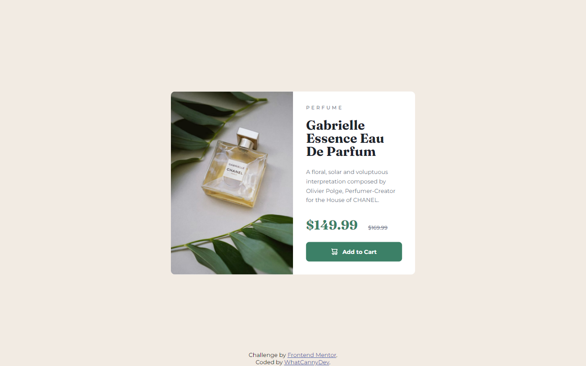

# Frontend Mentor - Product preview card component solution

This is a solution to the [Product preview card component challenge on Frontend Mentor](https://www.frontendmentor.io/challenges/product-preview-card-component-GO7UmttRfa). Frontend Mentor challenges help you improve your coding skills by building realistic projects. 

## Table of contents

- [Overview](#overview)
  - [The challenge](#the-challenge)
  - [Screenshot](#screenshot)
  - [Links](#links)
- [My process](#my-process)
  - [Built with](#built-with)
  - [What I learned](#what-i-learned)
  - [Continued development](#continued-development)
  - [Useful resources](#useful-resources)
- [Author](#author)

## Overview

### The challenge

Your challenge is to build out this product preview card component and get it looking as close to the design as possible.

You can use any tools you like to help you complete the challenge. So if you've got something you'd like to practice, feel free to give it a go.

Users should be able to:

- View the optimal layout depending on their device's screen size
- See hover and focus states for interactive elements

### Screenshot

### Links

- Solution Repository URL: [Click here](https://github.com/CannyRo/FrontendMentor_ResultsSummaryComponent-CE_K6s0maV)
- Live Site URL: [Click here](https://cannyro.github.io/FrontendMentor_ResultsSummaryComponent-CE_K6s0maV/)

## My process

### Built with

- Semantic HTML5 markup
- CSS custom properties
- Flexbox
- Mobile-first workflow

### What I learned

Nothing in particular with this challenge.

### Continued development

I've got into the bad habit of managing images via a div and its image background instead of using the img Hml element. I should use it and explore how does it work?

### Useful resources

- [Letter spacing with CSS](https://developer.mozilla.org/en-US/docs/Web/CSS/letter-spacing) - This helped me to adapt the perfect letter spacing for the product category and the description.
- [Text decoration](https://developer.mozilla.org/fr/docs/Web/CSS/text-decoration) - This helped me to strike out the original price for discount view.

## Author

- Website - [WhatCannyDev is searching a work-study contract in France](https://cannyro.github.io/hire_mr_canny/en)
- Frontend Mentor - [@CannyRo](https://www.frontendmentor.io/profile/CannyRo)
- GitHub - [@CannyRo](https://github.com/CannyRo)
- LinkedIn - [Ronan CANNY](https://www.linkedin.com/in/ronan-canny-b29443277/)
